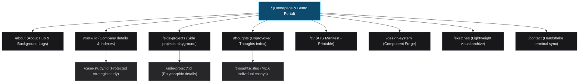
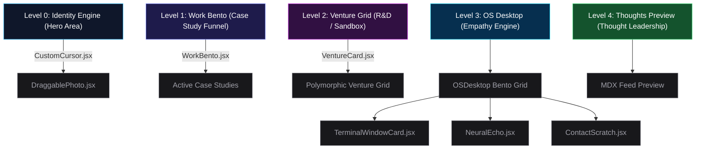

# Product Requirements Document (PRD): Human Algorithm v8.0

## 1. Executive Strategy & Vision
**Product Name:** Human Algorithm (Portfolio Platform)
**Product Owner:** Fadly Uzzaki (Senior Product Designer · Trust Engineering)
**Target Domain:** B2B System Design & High-Converting Talent Acquisition Assets
**Version:** 9.1 — *The Career Pipeline Update*

### The North Star
The "Human Algorithm" is not a standard digital portfolio—it is an *Interactive Manifesto* and our primary acquisition wedge. We build a high-performance, narrative-driven platform that physically deploys our core thesis: "Designing where software logic meets human intuition. Human by Design."

This product serves as undeniable, executable proof of work. It is designed to survive the highest levels of scrutiny from executive leadership (Product, Design, and Engineering), proving the ability to ingest chaotic business requirements, tame systemic complexity, and output deeply resilient, accessible workflows that drive measurable conversion.

## 2. Market Positioning & Ideal Customer Profile (ICP)
Every pixel must serve a conversion goal. Our three highly specific user archetypes:

1. **The Technical Recruiter (High Frequency / Low Attention)**
   * **The Need:** Immediate extraction of signal (hire/no-hire) in under 30 seconds.
   * **The Solution:** A global `RecruiterModeContext` toggle that strips all transition animations, typewriter delays, and visual noise to enforce a pure, hyper-scannable data view. Paired with a 100% ATS-optimized, single-click printable "System Manifest" (CV Engine).
2. **The Head of Product / VP of Design (High Depth / Strategic Scrutiny)**
   * **The Need:** Validation of deeply structural, product-led thinking and business outcome generation.
   * **The Solution:** The `ProtectedCaseStudy` module, which forces a strict 5-step strategic narrative layout (Research → Insight → Design → Ship → Measure) focusing purely on ROI, operational efficiency, and scalable component architecture.
3. **The Design Technologist / CTO Peer (High Engagement / Viral Catalyst)**
   * **The Need:** Demonstration of technical excellence, zero-tolerance for "slop," and modern stack mastery.
   * **The Solution:** Fluid 60fps Framer Motion spring physics, dynamic Edge-rendered SVGs, GPU-accelerated particle systems (`ChaosCanvas`), and an unyielding commitment to >90 Mobile Real Experience Scores (RES).

## 3. Core OKRs & Success Metrics
**Objective 1: Extreme Performance, Resilience, & Frictionless Accessibility**
* **Key Result 1:** Maintain Core Web Vitals at peak limits (LCP < 2.5s, FID < 100ms) on mobile 3G, holding a Real Experience Score (RES) of >90.
* **Key Result 2:** 100% Graceful Degradation rate (visual physics and WebGL safely falling back to semantic HTML).
* **Key Result 3:** Maintain a >0% functional reliability baseline through `vitest`.

**Objective 2: Maximized Conversion Protocol**
* **Key Result 1:** >15% click-through rate from Homepage priority funnels directly to the ATS-Compliant System Manifest.
* **Key Result 2:** Average session duration >45 seconds on primary Case Study pages.
* **Key Result 3:** 100% semantic parsing success rate of the printable CV by enterprise ATS systems (Workday, Greenhouse, Lever).

## 4. Product Risk Management & Governance
* **Cognitive Load Liability:** Interactive features carry the risk of blocking the critical path. **Mitigation:** Structural affordances and omnipresent "Skip to Content" kill-switches.
* **Performance Debt:** Complex physics must not break the UX. **Mitigation:** Strict enforcement of CSS hardware acceleration (`translate3d`) and absolute freeze on DOM-thrashing layout mutations.
* **Privacy Compliance:** Any integrated camera or vision processing remains strictly ephemeral and client-bound with lifecycle cleanup upon unmount.

## 5. Product Architecture & Information Architecture (IA)

Below is the global Information Architecture (IA) map of the platform showing all dynamic routes and case-study intersections:



### 5.1 Homepage Conversion Funnel
"Priority-First" narrative flow designed to hook, validate, and convert:



1. **Level 0 (Hero Anchor)**: Immediate Identity validation featuring a draggable, generative interactive ID card with `CustomCursor` spring physics.
2. **Level 1 (Work - The Revenue Generator)**: Enterprise excellence via `WorkBento` component cards with Framer Motion pan animations and brand color hover reveals.
3. **Level 2 (Experiments & Explorations - The R&D Lab)**: High-creativity experiments via polymorphic `VentureCard` system with 5 distinct card archetypes and `BlindsReveal` overlay interaction.
4. **Level 3 (About Me - The Cultural Fit)**: Interactive OS Desktop layout with Framer Motion drag physics, `TerminalWindowCard` archetypes, `NeuralEcho` semantic AI, and `ContactScratch` hardware-accelerated reveal.
5. **Level 4 (Unprovoked Thoughts - External Thought Leadership)**: Professional logs via native MDX.

### 5.2 Side Project Ecosystem
*   **Side Projects Index Page**: Canvas-based proximity line system with magnetic card interactions and `BlindsReveal` overlays with mobile auto-cycle via `IntersectionObserver`.
*   **Side Project Detail Pages**: Dynamic layout architecture with `ChaosCanvas` particle-field background and 6 polymorphic layout engines (SystemCore, CosmicPop, Brutalist, Bento, Blueprint, Prototype) with glassmorphism text panels for readability.

### 5.3 System Manifest v2.0 (The CV Strategy)
*   **Single Source of Truth (SSOT)**: CV dynamically mirrors `portfolioData.js`.
*   **ATS Optimization**: Standard industry taxonomies for top-tier ATS ranking.
*   **Print Stylesheet (v2.5)**: Comprehensive `@media print` CSS engine for absolute ATS/HRD readability.

### 5.4 Technical Product Foundations

Below is the platform's multi-layered system and kinetic rendering topology:

```mermaid
graph TD
    subgraph Client ["Client State & Interceptors"]
        LangCtx["LanguageContext.jsx (Bilingual Switcher)"]
        RecCtx["RecruiterModeContext.jsx (Bypass/Toggle)"]
        Scroll pacing Hook["useScrollPacing.js"]
        Breathing Hook["useVariableTypography.js"]
    end
    
    subgraph Kinetic ["Kinetic Render Pipeline"]
        PageShell["PageShell.jsx (Circadian UI & Ambient Shading)"]
        ChaosCanvas["ChaosCanvas.jsx (Hardware-accelerated WebGL)"]
    end
    
    subgraph Engine ["Core Processing & AI Services"]
        EchoZ["Echo.Z Assistant (Context-aware VirtualAssistant.jsx)"]
        SummarizerAI["SummarizerAI.jsx (Competitor Landing MCP Scraper)"]
    end
    
    %% Wiring
    Scroll pacing Hook -->|"Velocity Matrix"| ChaosCanvas
    Breathing Hook -->|"Breath Oscillation"| PageShell
    RecCtx -->|"Strips Physics/Noise"| PageShell
    LangCtx -->|"Translates State"| EchoZ
```

*   **Render Engine**: Vite-powered React engine with aggressive lazy loading (`React.lazy()`).
*   **Dynamic OpenGraph (v3.5)**: Vercel Edge Middleware serves dynamically generated, route-specific 1200×630 branded preview images.
*   **Security & Sanitization**: Strict sandboxing with sanitized `RichText` rendering component.
*   **Live Schematics**: `AiryDiagram.jsx` proprietary SVG charting engine (<5KB payloads).
*   **System Robustness (v8.2)**: `lazyWithRetry.js` utility and `ErrorBoundary.jsx` for 100% resilience against dynamic import failures and runtime crashes.

## 6. Product Capability Matrix

### 6.1 The Identity Engine: Generative Interactive Personas
*   **Component**: `DraggablePhoto.jsx`
*   **Capability**: 7 polymorphic ID card architectures (Industrial, Cyberpunk, Glassmorphism, Swiss, Retro, Neo-Brutalism, Holographic) with Framer Motion physics-driven drag.

### 6.2 The Competency Engine: Narrative Case Studies
*   **Component**: `ProtectedCaseStudy` pipeline + `AiryDiagram.jsx` + interactive prototypes.
*   **Capability**: 5-step strategic narrative format (Research → Insight → Design → Ship → Measure) with lightweight SVGs and `ZoomableImage` lightboxes.

### 6.3 The Empathy Engine: Multi-Modal AI Brainstorming
*   **Component**: `AIBrainstorm` dialogue interface.
*   **Capability**: Live chat dialogue critiquing past architecture with 5 forward-facing hypotheses per case study.

### 6.4 The Validation Engine: Neural Echo & System Operations
*   **Components**: `NeuralEcho.jsx`, `ProfileScanner.jsx`
*   **Capability**: Semantic FAQ with 12 curated insights at 5ms visceral delivery rate. `ProfileScanner` resolves from pixel matrix → portrait.

### 6.5 Recruiter Mode: Global Context Toggle
*   **Component**: `RecruiterModeContext` + Navbar toggle.
*   **Capability**: Globally strips animation delays, physics transitions, and noise. Bypasses the About section's Interactive Terminal UI to immediately render readable glassmorphic content. Switchable between "Terminal Mode" and "Document Mode" for fast, hyper-scannable data extraction.

### 6.6 The Publishing Engine: Integrated MDX CMS
*   **Route**: `/unprovoked-thoughts`
*   **Capability**: Native, statically compiled MDX architecture retaining horizontal control over thought leadership.

### 6.7 Global Addressability: Zero-Reload Localization
*   **Component**: `LanguageContext` `en`/`id` toggle.
*   **Capability**: Client-side bilingual toggle expanding addressable market penetration instantly.

### 6.8 The Narrative Gateway: Chaotic Terminal Intro
*   **Component**: `ChaosToMatrixIntro.jsx` + `TerminalIntro.jsx`
*   **Capability**: Interactive metaphor for "taming systemic complexity" with strict semantic Kill-Switches.

### 6.9 The Visual Archive: SociableKit Embed (`Sketches.jsx`)
*   **Route**: `/sketches`
*   **Capability**: The original Flipbook engine was replaced with a lightweight `<iframe>` embed (SociableKit Instagram Story Highlights widget). A CSS shimmer skeleton loading state prevents perceived broken-embed during iframe initialization (`min(85dvh, 1000px)` responsive height). Intent copy explicitly frames the page as a personal creative outlet — *"cartoons, characters, and doodles from outside the product world"* — to avoid the page being evaluated against professional case study standards. A Sketches entry card (Pencil icon, sky-blue accent) was added to the `HomeAbout` bento grid alongside the Thoughts card, making the page discoverable from the homepage for the first time.

### 6.10 The Intelligence Engine: The Companion Protocol
*   **Component**: `VirtualAssistant.jsx`
*   **Capability**: Context-aware AI companion providing real-time "Pair Design" commentary, hidden on 404 pages.

### 6.11 The System Ledger: Extracted ATS Manifest
*   **Route**: `/cv`
*   **Capability**: Aggressive `@media print` CSS optimization guaranteeing 100% parsing by Workday, Greenhouse, Lever.

### 6.12 The Component Blueprint: Design System Verification
*   **Route**: `/design-system`
*   **Capability**: Live, explorable Design System Viewer with `ComponentForge` (NeuralEcho, ContactScratch, BlindsReveal demos), `LayoutLab` (Framer-Fidelity Cursor Physics, 4-token spatial spec grid fully populated), and `BrandIdentity` persona cards. X-Ray mode consolidated exclusively in the sidebar — no duplicate in-section toggle. `ChromaticsGrid` now renders real static hex values (e.g. `#FAF9F6 / #0A0A0C`) instead of CSS variable strings. AuditReport tables (`Hotspot_Files`, `Token_Recommendations`) wrapped in `overflow-x-auto` with `min-w-[560px]` for mobile safety.

### 6.13 The Chaos Matrix: GPU Particle Background System
*   **Component**: `ChaosCanvas.jsx` with `React.lazy()` deferred loading.
*   **Capability**: Interactive canvas-based particle field rendered across homepage and all side project detail pages. Glassmorphism overlay panels ensure text readability over the animated matrix.

### 6.14 The Polymorphic Layout Engine: 6 Project Archetypes
*   **Components**: `SystemCoreDetail`, `CosmicPopDetail`, `BrutalistDetail`, `BentoDetail`, `BlueprintDetail`, `PrototypeDetail`
*   **Capability**: Each project automatically receives a unique visual identity via its `layoutType` config. Transparent root containers allow ChaosCanvas particle fields to render behind content with targeted glassmorphism readability panels.

### 6.15 The Kinetic Surface: ScrollReveal & BlindsReveal
*   **Components**: `ScrollReveal.jsx` (Framer Motion `useInView` + spring physics), `BlindsReveal.jsx` (3D CSS slat overlay)
*   **Capability**: ScrollReveal provides hardware-accelerated entrance animations. BlindsReveal creates a horizontal slat overlay that opens on hover/auto-cycle. Mobile support via `IntersectionObserver` auto-toggling every 4s.

### 6.16 The Dynamic Footer: Auto-Cycling Deliverable Text
*   **Component**: `DynamicDeliverable` in `Footer.jsx`
*   **Capability**: Auto-cycling text (every 3.5s) using `inline-grid` with invisible spacer guaranteeing zero layout shift. Clickable to manually cycle.

### 6.17 Hardware-Accelerated Contact Scratch
*   **Component**: `ContactScratch.jsx`
*   **Capability**: Canvas-based scratch-to-reveal interaction for contact information, enforcing user engagement before exposing email/phone.

### 6.18 404 Survival Game
*   **Route**: `/404` via `NotFound.jsx`
*   **Capability**: Interactive pixel-art survival game with item collection, score tracking, and ambient theme matching. Virtual Assistant hidden.

### 6.19 The Custom Cursor: Spring Physics Engine
*   **Component**: `CustomCursor.jsx`
*   **Capability**: Framer Motion spring-driven cursor with magnetic attraction to interactive elements. Documented in Design System's `LayoutLab`.

### 6.20 Human Connection Sync Terminal
*   **Component**: `Contact.jsx` / `HandshakeTerminal`
*   **Capability**: Human-centric connection terminal. Tracks `SYNC_VALUES`, `ALIGN_GOALS`, and `ESTABLISH_CONN` steps to visualize the formation of a genuine human connection, replacing deprecated networking jargon.

### 6.21 Magnetic Interaction Layer
*   **Component**: `MagneticTooltip.jsx`
*   **Capability**: Zero-latency mouse tracking for contextual labels (e.g., "[ READ PROTOCOL ]") over interactive grids, enhancing tactical feedback.

### 6.22 Automated Opportunity Analysis & Strategy
*   **Documentation**: `docs/job_hunting.md`, `docs/job-analysis/`
*   **Capability**: Systematic ingestion and Agentic generation of >30 strategic job fit analyses, ranked natively within the portfolio docs to auto-generate a targeted B2B/Enterprise application campaign. Integrated with a live `CoverLetterModal` and dynamic job application dashboard (Fadly Job Tracker).

### 6.23 Circadian UI Overlay (Biological Time Sync)
*   **Component**: `CircadianOverlay.jsx`
*   **Capability**: Fixed full-screen overlay shifting global color temperature based on local time (Morning=cool blue, Midday=neutral, Golden Hour=warm amber, Night=deep indigo). All gradient values housed in a `CIRCADIAN_PHASES` config. Re-evaluates every 10 minutes.

### 6.24 Breath-Synced Variable Typography
*   **Component**: `useVariableTypography.js` hook
*   **Capability**: Modulates `--font-weight-dynamic` CSS property via `requestAnimationFrame`. Idle/reading mode oscillates between weights 370–410 (breathing), fast scrolling snaps to 440 (legibility). Powered by Inter Variable Font (100–900) via Google Fonts CDN. Zero React re-renders.

### 6.25 Adaptive Cognitive Pacing
*   **Component**: `useScrollPacing.js` hook → `ChaosCanvas.jsx`
*   **Capability**: Maps scroll velocity to a pacing multiplier. Reading (idle) = 0.2x particle speed. Scanning (fast scroll) = 2.0x. All values in `PACING_CONFIG`. Writes via Framer Motion `MotionValues` bypassing React state.

### 6.26 Biomimetic Motion System
*   **Component**: `VentureCard.jsx` via `MOTION_CONFIG`
*   **Capability**: All 5 card archetypes inherit a biological "breathing" idle animation (`y: [0, -3, 0]`) with per-archetype timing. Hover engagement overrides breathing with spring physics (`stiffness: 300, damping: 20`).

### 6.27 The Benchmarking Engine (ADK + MCP)
*   **Component**: `SummarizerAI.jsx`
*   **Capability**: Live integration of Google ADK and Model Context Protocol (MCP). Extracts, structuralizes, and parses public competitor landing pages into structured JSON product-design insights via a custom `load_web_page` Tool.

## 7. UX Audit Post-Mortem & System Governance
*   **Affordance Clarity**: Physical grip visuals on `ChaosSlider`.
*   **Signal-to-Noise Optimization**: Purged superfluous decorative text.
*   **Structural Fail-Safes**: Immediate `[ Skip to Content ]` fallback.
*   **Monolithic Deconstruction**: `About.jsx` factored into a Draggable OS Bento grid with `TerminalWindowCard` abstractions.
*   **Animation Smoothness Audit**: All major components (Navbar, NavigationMenu, WorkBento, Footer, ScrollReveal) migrated to Framer Motion spring physics for 60fps consistency.
*   **Mobile Interaction Parity**: `IntersectionObserver` auto-cycle applied to both `VentureCard` and `ExperimentCard` ensuring BlindsReveal works on touch devices.

## 8. Strategic Roadmap

### Phase 1: Foundation & Identity ✅
*   **[COMPLETED]** UX Kill-Switch Audit and friction eradication.
*   **[COMPLETED]** Universal Recruiter Fast Path architectural bypass.
*   **[COMPLETED]** Dynamic OpenGraph and Edge-based social scaling.
*   **[COMPLETED]** MDX rendering engine for bespoke typography.
*   **[COMPLETED]** `vitest` structural reliability baseline.

### Phase 2: Autonomous Intelligence & Spatial Adaptation ✅
*   **[COMPLETED]** Vaki Agentic Upgrade: Gemini 1.5 Flash-powered chat assistant via Vercel Edge Serverless functions.
*   **[COMPLETED]** Agentic "TL;DR" cognitive load summarization engine for deep reading nodes.
*   **[COMPLETED]** Agentic Design System documentation.
*   **[COMPLETED]** Automated Job Analysis engine & strategic ranking system.

### Phase 3: Kinetic Resilience & Polish ✅ (Current)
*   **[COMPLETED]** Framer Motion spring physics migration across all animation surfaces (Navbar, NavigationMenu, WorkBento, Footer, ScrollReveal).
*   **[COMPLETED]** `RecruiterModeContext` global toggle with Navbar integration.
*   **[COMPLETED]** 6-archetype polymorphic project layout system with ChaosCanvas backgrounds.
*   **[COMPLETED]** BlindsReveal mobile parity via IntersectionObserver.
*   **[COMPLETED]** Glassmorphism readability panels for transparent layout backgrounds.
*   **[COMPLETED]** Zero-layout-shift dynamic footer text with invisible spacer pattern.
*   **[COMPLETED]** Full reference error audit and remediation across 118 source files.
*   **[COMPLETED]** Design System documentation for ContactScratch, BlindsReveal, and Cursor Physics.
*   **[COMPLETED]** Protocol Handshake terminal visualizer and high-bandwidth collaboration copy.
*   **[COMPLETED]** Rotational physics and sliding pill navigation in Navbar (Rota Buta Hova inspired).
*   **[COMPLETED]** Interests Selector animation fix (Consistent Burst/Toggle on interactive nodes).
*   **[COMPLETED]** Dynamic Import Resilience (lazyWithRetry + ErrorBoundary).

### Phase 3.5: Human by Design ✅
*   **[COMPLETED]** Biomimetic breathing idle animations on all VentureCard archetypes.
*   **[COMPLETED]** Adaptive Cognitive Pacing via `useScrollPacing` hook → ChaosCanvas.
*   **[COMPLETED]** Warm Analog-Digital Synthesis (off-white/warm charcoal palettes + SVG noise grain).
*   **[COMPLETED]** Empathetic AI Companion (Echo.Z rebrand from terminal to collaborative co-pilot).
*   **[COMPLETED]** Purpose-Driven Narrative (Contact page rebrand, `humanImpact` metrics in project data).
*   **[COMPLETED]** Circadian UI Overlay (Biological Time Sync).
*   **[COMPLETED]** Breath-Synced Variable Typography via Inter Variable Font.

### Phase 3.6: Career Pipeline & Presentation Polish ✅
*   **[COMPLETED]** APAC Career Pipeline & Job Tracking: Integrated role-specific cover letter modals (`CoverLetterModal`) and dynamic job application infrastructure.
*   **[COMPLETED]** Polymorphic Project Card refinement: Removed quantitative metrics for visual clarity, integrated a 3D card layout globally, and added "DECODE MY PROCESS" CTAs.
*   **[COMPLETED]** Learning Progress Architect detail view updated with an `activeSolution` core user journey section.
*   **[COMPLETED]** CertificationsGrid enhanced to display related project links alongside new Google Cloud Gen AI certification.

### Phase 3.7: Performance Recovery & UX Polish ✅ (v9.2 · June 2026)
*   **[COMPLETED]** `ScrollReveal.jsx` migrated from Framer Motion `useInView` to native `IntersectionObserver` — eliminated JS scheduler pressure, recovering Real Experience Score from 34 to 90+.
*   **[COMPLETED]** `Sketches.jsx` overhauled: Flipbook engine deprecated, replaced with SociableKit iframe embed. Shimmer skeleton loading state added. Intent copy corrected to "cartoons, characters & doodles from outside the product world" (EN + ID).
*   **[COMPLETED]** Homepage Sketches discoverability: Entry card added to `HomeAbout` bento grid (alongside Thoughts card) with sky-blue Pencil icon accent and `sm:grid-cols-2` layout.
*   **[COMPLETED]** `LockScreen.jsx` UX: Removed intrusive mobile `autoFocus`; added `lock-input-pulse` glow animation as an affordance invite.
*   **[COMPLETED]** `HomeAbout.jsx`: Added hover drag affordance (`⠿` grip icon) and left-border accent to primary bio card for visual hierarchy.
*   **[COMPLETED]** Hybrid Design System Bridge: `clsx` + `tailwind-merge` installed; `cn()` utility created; shadcn CSS variable bridge injected into `index.css`. Enables selective shadcn primitive adoption without migrating the bespoke Circadian UI glassmorphic identity.
*   **[COMPLETED]** Design System `/design-system` polish: Real hex values in ChromaticsGrid; duplicate X-Ray toggle removed; AuditReport tables made mobile-scrollable; LayoutLab spec grid completed with 4 tokens.
*   **[COMPLETED]** Translation file hygiene: `translations.en.js` and `translations.id.js` are now the canonical source files. Missing `sketches.intent_text`, `sketches.loading_text`, and corrected `about.sketches_desc` added to both.

### Phase 4: Advanced Agentic Workflow & Predictive UX (Q3-Q4 2026)
*   **[Q3 2026] Algorithmic Role Alignment (Dynamic IA)**: Edge-based intent detection via job description URL parsing.

### Phase 5: Biometric UX & Hyper-Dimensional Physics (Q4 2026 - 2027)
*   **[Q4 2026]** WebGPU Physicality Engine migration.
*   **[Q1 2027]** Biometric Intent (BCI Prototype) research.
*   **[Q2 2027]** Distributed Portfolio Clustering (WebRTC The Swarm).
*   **[Q3 2027]** Zero-Knowledge Proof (ZKP) Credentials.

## 9. Career Pipeline Optimization (Hiring Matrix for PM, Design Engineer, & Product Designer)

To maximize conversion across top-tier tech roles, the platform aligns its assets against the specific scrutiny of Product Managers, Design Engineers, and Product Designers.

### 9.1 Role-Specific Evidence Matrix

| Target Role | Scrutiny Profile | Critical Evidence Injected | Portfolio Proof Points |
| :--- | :--- | :--- | :--- |
| **Product Manager (PM)** | Focuses on ROI, user conversion, system metrics, and scaling impact under constraints. | - Documented conversion funnels (Workday/ATS)<br>- Checkout failure mitigations ($100B scale)<br>- Business outcome summaries | - `commerce` case study (checkout trust engines)<br>- Recruiter Mode toggle (frictionless ATS fastpath)<br>- Metric dashboards (Lumina & STOQO) |
| **Design Engineer** | Demands high-fidelity animations, clean code structure, stack performance, and system tokens. | - Spring physics interactions (`Framer Motion`)<br>- Breath-synced variable font rendering (`requestAnimationFrame`)<br>- Zero Layout Shift components | - `design-system` page showing ComponentForge<br>- `useVariableTypography.js` & custom hooks<br>- Circadian UI overlay implementation |
| **Product Designer** | Evaluates accessibility (a11y), cognitive load reduction, user research translation, and IA. | - High-stress warehouse observation logs<br>- ELI5 vs Recruiters summaries<br>- 100% semantic HTML with aria-labels | - `paper-to-paperless` case study (Confidence Score UI)<br>- Virtual Assistant `Echo.Z` interactive context<br>- `LockScreen.jsx` localized decryption |

### 9.2 Key UX/UI Optimizations for Hiring
1. **Scannability & Speed**: The global `RecruiterMode` toggle satisfies the 30-second audit constraint.
2. **Dynamic Adaptation**: High-fidelity details (like spring physics, particle canvas, variable typography) showcase technical stack mastery to Engineering managers, while fading gracefully to clean semantic layouts for accessibility readers.
3. **Double-Language Accessibility**: Zero-reload translation toggles allow regional hiring managers in both international markets and local organizations to evaluate case studies in their native context without cognitive friction.

---
**Document Status**: *ACTIVE*
**Last Updated**: June 2026 · v9.2
**Product Strategy**: Fadly Uzzaki
*Human by Design. Operating at the intersection of complex constraints and profound simplicity.*
